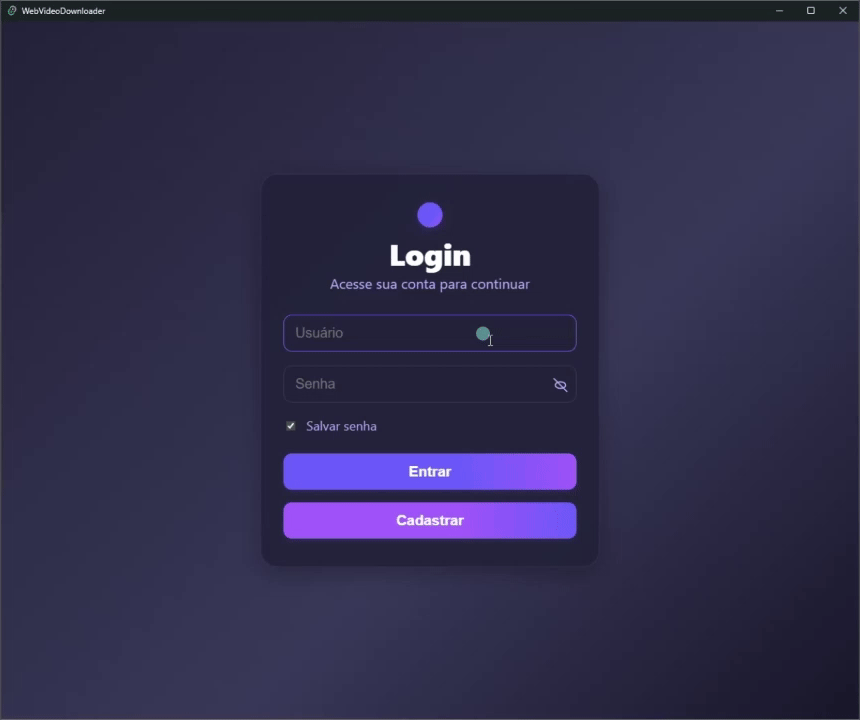
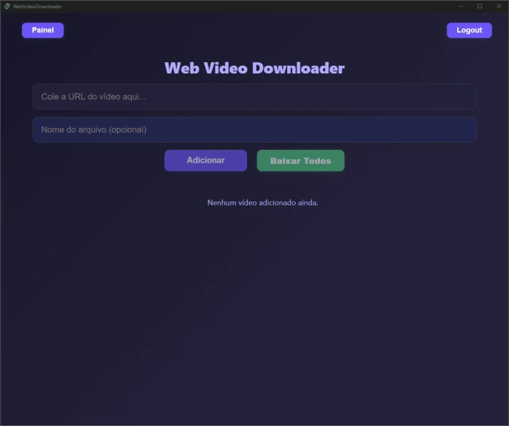
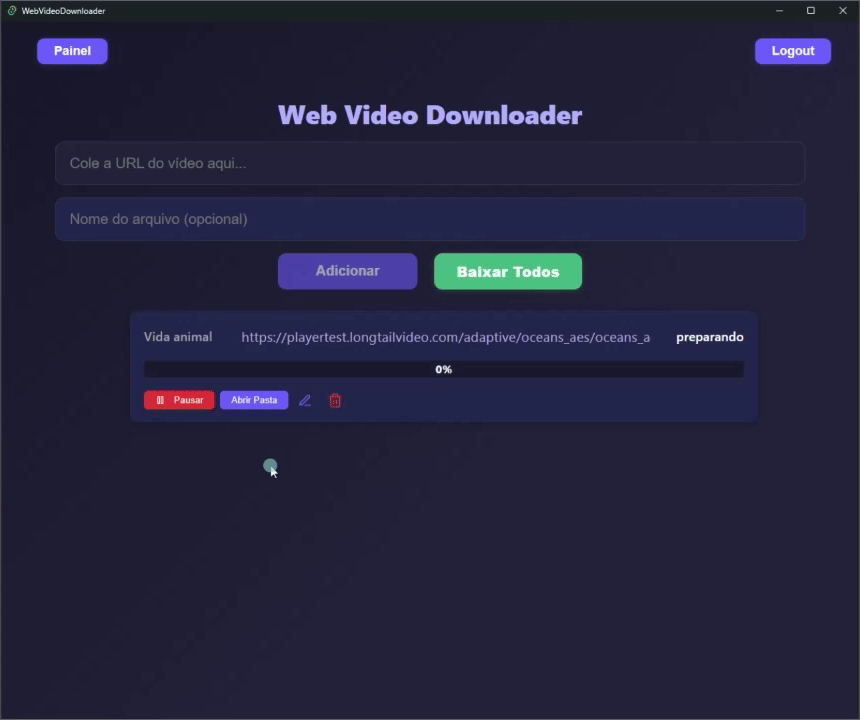
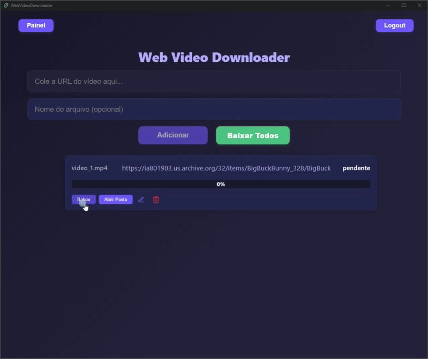
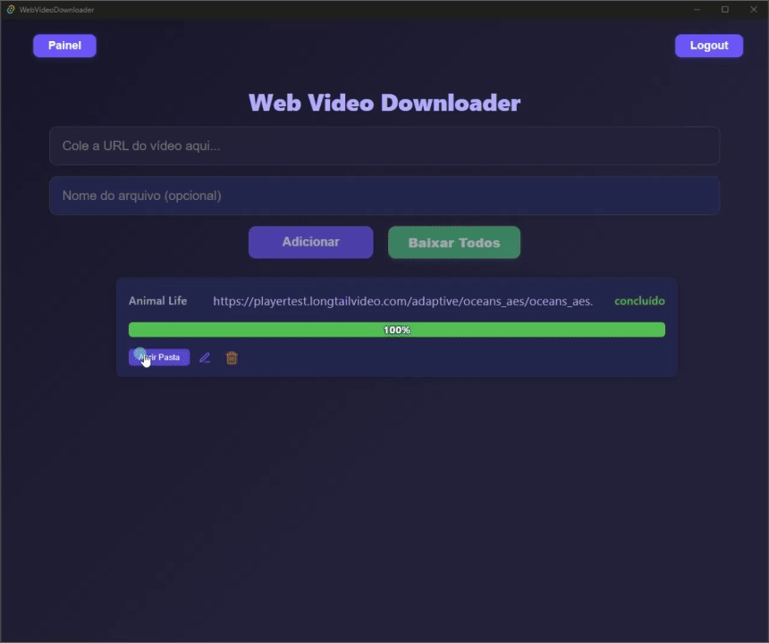
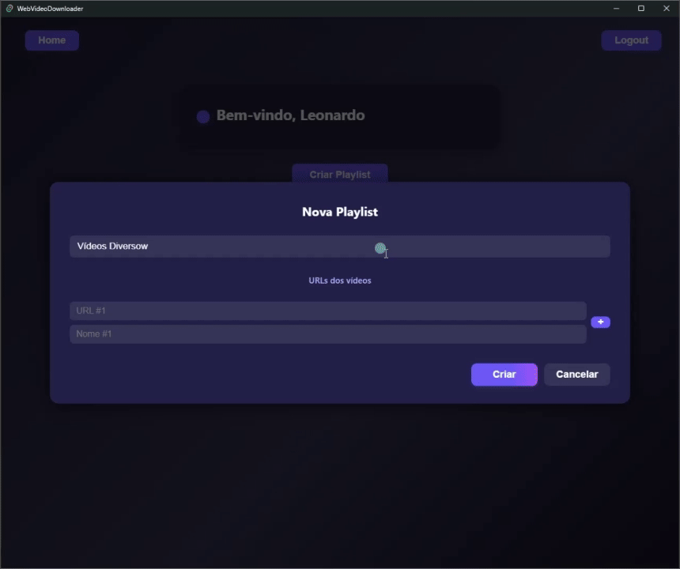
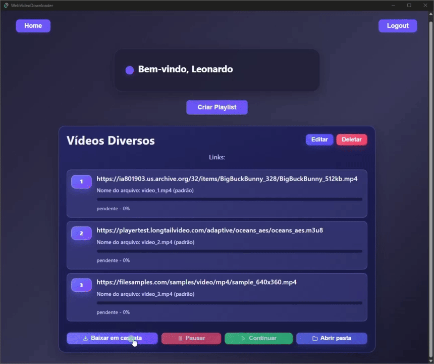

# Web Video Downloader

<p align="center">
	<b>Desktop app to organize and download videos from web URLs with playlist workflows</b><br/>
	
	
	
	
	
	
</p>

## Overview

Web Video Downloader is a desktop-first application that combines a modern React UI with a high-performance Rust backend through Tauri.

It was designed to make the full download lifecycle simple for real users: authenticate, save links, download one or many videos, pause/resume when needed, and organize media inside named playlists.

The app supports both direct MP4 links and special streaming sources (including `.m3u8` and JMV-like players), with persisted progress and resilient resume behavior.

## Key Features

- User authentication (register/login) with persistent session handling.
- Home download queue for quick single video operations.
- Playlist-based workflow in User Panel with custom names and grouped links.
- Cascade mode to download playlist videos one-by-one.
- Pause/resume support with state persistence in local JSON files.
- Disk sync checks to avoid re-downloading files that already exist.
- Open destination folders directly from the interface.
- Real-time progress tracking and status updates from backend to frontend.

## Visual Highlights

| Feature                          | Demo                                                                         |
| -------------------------------- | ---------------------------------------------------------------------------- |
| Login flow                       |                                            |
| Create main download item        |              |
| Start main video download        |                |
| Pause and continue main download |    |
| Open output folder from app      |    |
| Create new playlist              |                |
| Cascade playlist download        |  |

## How to Run Locally

Prerequisites: Node.js LTS, Yarn, Rust stable toolchain, and Tauri v2 OS dependencies.

Reference: https://v2.tauri.app/start/prerequisites/

```bash
yarn
yarn tauri dev
```

Frontend only (without Tauri backend):

```bash
yarn dev
```

## Available Scripts

| Command          | Description                       |
| ---------------- | --------------------------------- |
| `yarn dev`       | Start Vite frontend dev server    |
| `yarn build`     | Build frontend for production     |
| `yarn lint`      | Run ESLint                        |
| `yarn preview`   | Preview frontend production build |
| `yarn tauri dev` | Run desktop app in development    |

## Data Persistence

| File                               | Purpose                                  |
| ---------------------------------- | ---------------------------------------- |
| `user_data/user.json`              | Stores users and main URL list           |
| `user_data/panel_playlists.json`   | Stores user playlists and playlist links |
| `user_data/download_progress.json` | Stores per-download progress and status  |

Downloaded media is stored in:

- `Vídeos baixados/` for Home downloads
- `Vídeos baixados/<Playlist Name>/` for playlist downloads

## Architecture Snapshot

1. Frontend invokes Tauri commands such as `start_download`, `download_special_video`, and `get_progress_command`.
2. Rust backend performs HTTP/HLS download logic, writes progress state, and emits events.
3. Frontend polls/updates UI state in real time and keeps playlist/home views synchronized.
4. Resume, pause, and cascade control are persisted across sessions.

## About

This project was developed by Leonardo Florentino Fernandes as a practical desktop tool and portfolio-grade software architecture exercise.

It demonstrates a production-minded integration between React/TypeScript and Rust/Tauri, focused on reliability, UX clarity, and maintainable structure for long-running download workflows.
